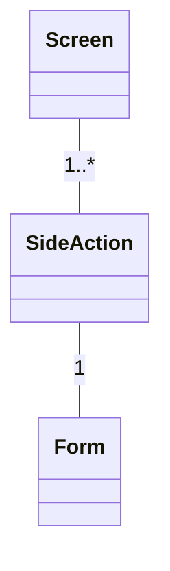
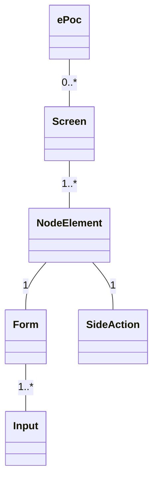

<!-- ## Data structure in the menu bar


---

## Data structure in the graph


---

## Data Structure in the form
```mermaid
classDiagram
  Form -- Field: 1..*
  Field -- Input: 1..*
  Field -- Card: 0..*
  Card -- Input: 1..*

``` -->
